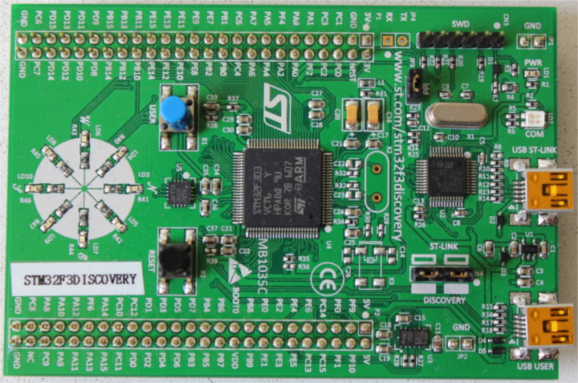

# Meet Your Hardware

Let's get familiar with the hardware we'll be working with.

## STM32F3DISCOVERY (the "F3")

What does this board contain?

- A [STM32F303VCT6](https://www.st.com/en/microcontrollers/stm32f303vc.html) microcontroller. This microcontroller has
  - A single-core ARM Cortex-M4F processor with hardware support for single-precision floating point
    operations and a maximum clock frequency of 72 MHz.

  - 256 KiB of "Flash" memory. (1 KiB = 10**24** bytes)

  - 48 KiB of RAM.

  - A variety of integrated peripherals such as timers, I2C, SPI and USART.

  - General purpose Input Output (GPIO) and other types of pins accessible through the two rows of headers along side the board.
  
  - A USB interface accessible through the USB port labeled "USB USER".

- An [accelerometer](https://en.wikipedia.org/wiki/Accelerometer) as part of the [LSM303DLHC](https://www.st.com/en/mems-and-sensors/lsm303dlhc.html) chip.

- A [magnetometer](https://en.wikipedia.org/wiki/Magnetometer) as part of the [LSM303DLHC](https://www.st.com/en/mems-and-sensors/lsm303dlhc.html) chip.

- A [gyroscope](https://en.wikipedia.org/wiki/Gyroscope) as part of the [L3GD20](https://www.pololu.com/file/0J563/L3GD20.pdf) chip.

- 8 user LEDs arranged in the shape of a compass.

- A second microcontroller: a [STM32F103](https://www.st.com/en/microcontrollers/stm32f103cb.html). This microcontroller is actually part of an on-board programmer / debugger and is connected to the USB port named "USB ST-LINK".

For a more detailed list of features and further specifications of the board take a look at the [STMicroelectronics](https://www.st.com/en/evaluation-tools/stm32f3discovery.html) website.

A word of caution: be careful if you want to apply external signals to the board. The microcontroller STM32F303VCT6 pins take a nominal voltage of 3.3 volts. For further information consult the [6.2 Absolute maximum ratings section in the manual](https://www.st.com/resource/en/datasheet/stm32f303vc.pdf)
