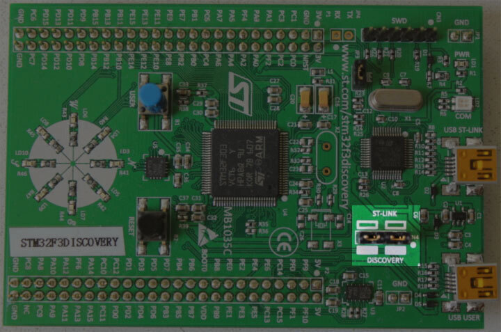

# Verify Installation

In this section we check that some of the required tools / drivers have been
correctly installed and configured.

Connect your laptop / PC to the discovery board using a Mini-USB USB cable. The
discovery board has two USB connectors; use the one labeled "USB ST-LINK" that
sits on the center of the edge of the board.

Also check that the ST-LINK header is populated. See the picture below; the
ST-LINK header is highlighted.

<p align="center">

</p>

Now run the following command:

``` console
openocd -f interface/stlink.cfg -f target/stm32f3x.cfg
```

> **NOTE**: Old versions of openocd, including the 0.10.0 release from 2017, do
> not contain the new (and preferable) `interface/stlink.cfg` file; instead you
> may need to use `interface/stlink-v2.cfg` or `interface/stlink-v2-1.cfg`.

You should get the following output and the program should block the console:

``` text
Open On-Chip Debugger 0.10.0
Licensed under GNU GPL v2
For bug reports, read
        http://openocd.org/doc/doxygen/bugs.html
Info : auto-selecting first available session transport "hla_swd". To override use 'transport select <transport>'.
adapter speed: 1000 kHz
adapter_nsrst_delay: 100
Info : The selected transport took over low-level target control. The results might differ compared to plain JTAG/SWD
none separate
Info : Unable to match requested speed 1000 kHz, using 950 kHz
Info : Unable to match requested speed 1000 kHz, using 950 kHz
Info : clock speed 950 kHz
Info : STLINK v2 JTAG v27 API v2 SWIM v15 VID 0x0483 PID 0x374B
Info : using stlink api v2
Info : Target voltage: 2.919881
Info : stm32f3x.cpu: hardware has 6 breakpoints, 4 watchpoints
```

The contents may not match exactly but you should get the last line about
breakpoints and watchpoints. If you got it then terminate the OpenOCD process
and move to the [next section].

[next section]: ../../start/index.md

If you didn't get the "breakpoints" line then try one of the following commands.

``` console
openocd -f interface/stlink-v2.cfg -f target/stm32f3x.cfg
```

``` console
openocd -f interface/stlink-v2-1.cfg -f target/stm32f3x.cfg
```

If one of those commands works it means you got an old hardware revision of the
discovery board. That won't be a problem but commit that fact to memory as
you'll need to configure things a bit differently later on. You can move to the
[next section].

If none of the commands work as a normal user then try to run them with root
permission (e.g. `sudo openocd ..`). If the commands do work with root
permission then check that the [udev rules] have been correctly set.

[udev rules]: linux.md#udev-rules

If you have reached this point and OpenOCD is not working please open [an issue]
and we'll help you out!

[an issue]: https://github.com/rust-embedded/book/issues
