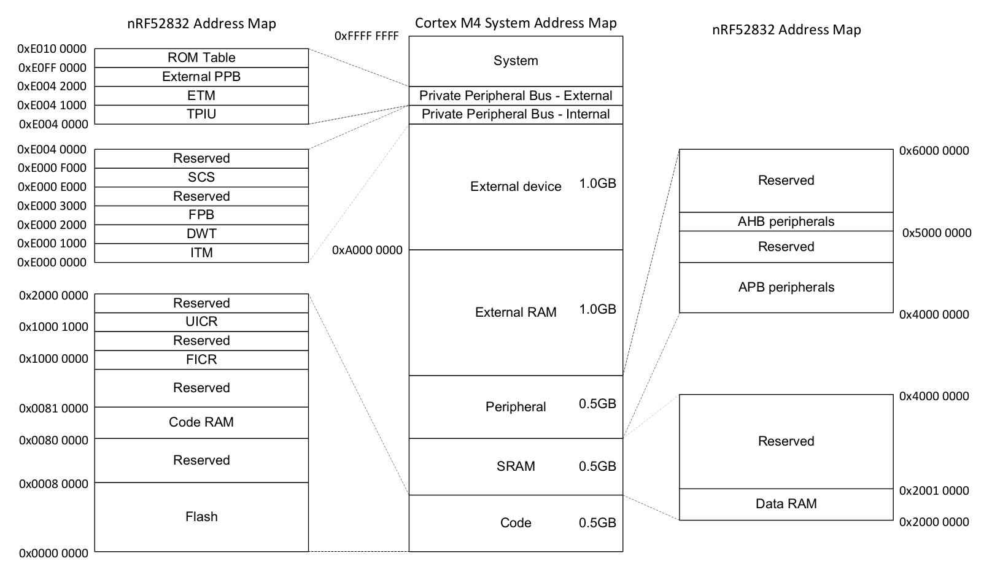
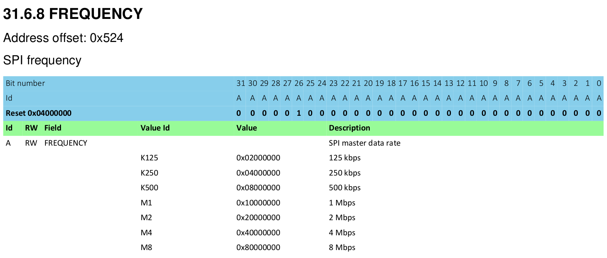

# Peripherals

## What are Peripherals?

Most Microcontrollers have more than just a CPU, RAM, or Flash Memory - they contain sections of silicon which are used for interacting with systems outside of the microcontroller, as well as directly and indirectly interacting with their surroundings in the world via sensors, motor controllers, or human interfaces such as a display or keyboard. These components are collectively known as Peripherals.

These peripherals are useful because they allow a developer to offload processing to them, avoiding having to handle everything in software. Similar to how a desktop developer would offload graphics processing to a video card, embedded developers can offload some tasks to peripherals allowing the CPU to spend its time doing something else important, or doing nothing in order to save power.

If you look at the main circuit board in an old-fashioned home computer from the 1970s or 1980s (and actually, the desktop PCs of yesterday are not so far removed from the embedded systems of today) you would expect to see:

* A processor
* A RAM chip
* A ROM chip
* An I/O controller

The RAM chip, ROM chip and I/O controller (the peripheral in this system) would be joined to the processor through a series of parallel traces known as a 'bus'. This bus carries address information, which selects which device on the bus the processor wishes to communicate with, and a data bus which carries the actual data. In our embedded microcontrollers, the same principles apply - it's just that everything is packed on to a single piece of silicon.

However, unlike graphics cards, which typically have a Software API like Vulkan, Metal, or OpenGL, peripherals are exposed to our Microcontroller with a hardware interface, which is mapped to a chunk of the memory.

## Linear and Real Memory Space

On a microcontroller, writing some data to some other arbitrary address, such as `0x4000_0000` or `0x0000_0000`, may also be a completely valid action.

On a desktop system, access to memory is tightly controlled by the MMU, or Memory Management Unit. This component has two major responsibilities: enforcing access permission to sections of memory (preventing one process from reading or modifying the memory of another process); and re-mapping segments of the physical memory to virtual memory ranges used in software. Microcontrollers do not typically have an MMU, and instead only use real physical addresses in software.

Although 32 bit microcontrollers have a real and linear address space from `0x0000_0000`, and `0xFFFF_FFFF`, they generally only use a few hundred kilobytes of that range for actual memory. This leaves a significant amount of address space remaining. In earlier chapters, we were talking about RAM being located at address `0x2000_0000`. If our RAM was 64 KiB long (i.e. with a maximum address of 0xFFFF) then addresses `0x2000_0000` to `0x2000_FFFF` would correspond to our RAM. When we write to a variable which lives at address `0x2000_1234`, what happens internally is that some logic detects the upper portion of the address (0x2000 in this example) and then activates the RAM so that it can act upon the lower portion of the address (0x1234 in this case). On a Cortex-M we also have our Flash ROM mapped in at address `0x0000_0000` up to, say, address `0x0007_FFFF` (if we have a 512 KiB Flash ROM). Rather than ignore all remaining space between these two regions, Microcontroller designers instead mapped the interface for peripherals in certain memory locations. This ends up looking something like this:

[Nordic nRF52832 Datasheet (pdf)]

## Memory Mapped Peripherals

Interaction with these peripherals is simple at a first glance - write the right data to the correct address. For example, sending a 32 bit word over a serial port could be as direct as writing that 32 bit word to a certain memory address. The Serial Port Peripheral would then take over and send out the data automatically.

Configuration of these peripherals works similarly. Instead of calling a function to configure a peripheral, a chunk of memory is exposed which serves as the hardware API. Write `0x8000_0000` to a SPI Frequency Configuration Register, and the SPI port will send data at 8 Megabits per second. Write `0x0200_0000` to the same address, and the SPI port will send data at 125 Kilobits per second. These configuration registers look a little bit like this:

[Nordic nRF52832 Datasheet (pdf)]

This interface is how interactions with the hardware are made, no matter what language is used, whether that language is Assembly, C, or Rust.

[Nordic nRF52832 Datasheet (pdf)]: http://infocenter.nordicsemi.com/pdf/nRF52832_PS_v1.1.pdf
