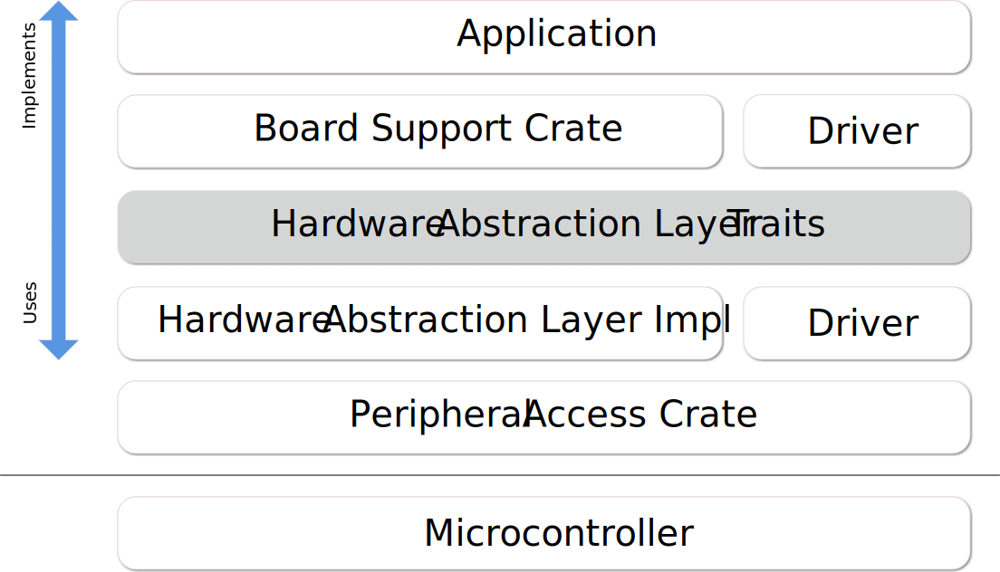

# Portability

In embedded environments portability is a very important topic: Every vendor and even each family from a single manufacturer offers different peripherals and capabilities and similarly the ways to interact with the peripherals will vary.

A common way to equalize such differences is via a layer called Hardware Abstraction layer or **HAL**.

> Hardware abstractions are sets of routines in software that emulate some platform-specific details, giving programs direct access to the hardware resources.
>
> They often allow programmers to write device-independent, high performance applications by providing standard operating system (OS) calls to hardware.
>
> *Wikipedia: [Hardware Abstraction Layer]*

[Hardware Abstraction Layer]: https://en.wikipedia.org/wiki/Hardware_abstraction

Embedded systems are a bit special in this regard since we typically do not have operating systems and user installable software but firmware images which are compiled as a whole as well as a number of other constraints. So while the traditional approach as defined by Wikipedia could potentially work it is likely not the most productive approach to ensure portability.

How do we do this in Rust? Enter **embedded-hal**...

## What is embedded-hal?

In a nutshell it is a set of traits which define implementation contracts between **HAL implementations**, **drivers** and **applications (or firmwares)**. Those contracts include both capabilities (i.e. if a trait is implemented for a certain type, the **HAL implementation** provides a certain capability) and methods (i.e. if you can construct a type implementing a trait it is guaranteed that you have the methods specified in the trait available).

A typical layering might look like this:

Some of the defined traits in **embedded-hal** are:
* GPIO (input and output pins)
* Serial communication
* I2C
* SPI
* Timers/Countdowns
* Analog Digital Conversion

The main reason for having the **embedded-hal** traits and crates implementing and using them is to keep complexity in check. If you consider that an application might have to implement the use of the peripheral in the hardware as well as the application and potentially drivers for additional hardware components, then it should be easy to see that the re-usability is very limited. Expressed mathematically, if **M** is the number of peripheral HAL implementations and **N** the number of drivers then if we were to reinvent the wheel for every application then we would end up with **M*N** implementations while by using the *API* provided by the **embedded-hal** traits will make the implementation complexity approach **M+N**. Of course there're additional benefits to be had, such as less trial-and-error due to a well-defined and ready-to-use APIs.

## Users of the embedded-hal

As said above there are three main users of the HAL:

### HAL implementation

A HAL implementation provides the interfacing between the hardware and the users of the HAL traits. Typical implementations consist of three parts:
* One or more hardware specific types
* Functions to create and initialize such a type, often providing various configuration options (speed, operation mode, use pins, etc.)
* one or more `trait` `impl` of **embedded-hal** traits for that type

Such a **HAL implementation** can come in various flavours:
* Via low-level hardware access, e.g. via registers
* Via operating system, e.g. by using the `sysfs` under Linux
* Via adapter, e.g. a mock of types for unit testing
* Via driver for hardware adapters, e.g. I2C multiplexer or GPIO expander

### Driver

A driver implements a set of custom functionality for an internal or external component, connected to a peripheral implementing the embedded-hal traits. Typical examples for such drivers include various sensors (temperature, magnetometer, accelerometer, light), display devices (LED arrays, LCD displays) and actuators (motors, transmitters).

A driver has to be initialized with an instance of type that implements a certain `trait` of the embedded-hal which is ensured via trait bound and provides its own type instance with a custom set of methods allowing to interact with the driven device.

### Application

The application binds the various parts together and ensures that the desired functionality is achieved. When porting between different systems, this is the part which requires the most adaptation efforts, since the application needs to correctly initialize the real hardware via the HAL implementation and the initialisation of different hardware differs, sometimes drastically so. Also the user choice often plays a big role, since components can be physically connected to different terminals, hardware buses sometimes need external hardware to match the configuration or there are different trade-offs to be made in the use of internal peripherals (e.g. multiple timers with different capabilities are available or peripherals conflict with others).
