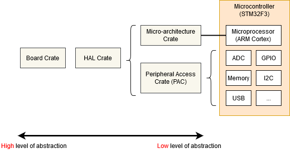

# Memory Mapped Registers

Embedded systems can only get so far by executing normal Rust code and moving data around in RAM. If we want to get any information into or out of our system (be that blinking an LED, detecting a button press or communicating with an off-chip peripheral on some sort of bus) we're going to have to dip into the world of Peripherals and their 'memory mapped registers'.

You may well find that the code you need to access the peripherals in your micro-controller has already been written, at one of the following levels:
<p align="center">

</p>

* Micro-architecture Crate - This sort of crate handles any useful routines common to the processor core your microcontroller is using, as well as any peripherals that are common to all micro-controllers that use that particular type of processor core. For example the [cortex-m] crate gives you functions to enable and disable interrupts, which are the same for all Cortex-M based micro-controllers. It also gives you access to the 'SysTick' peripheral included with all Cortex-M based micro-controllers.
* Peripheral Access Crate (PAC) - This sort of crate is a thin wrapper over the various memory-wrapper registers defined for your particular part-number of micro-controller you are using. For example, [tm4c123x] for the Texas Instruments Tiva-C TM4C123 series, or [stm32f30x] for the ST-Micro STM32F30x series. Here, you'll be interacting with the registers directly, following each peripheral's operating instructions given in your micro-controller's Technical Reference Manual.
* HAL Crate - These crates offer a more user-friendly API for your particular processor, often by implementing some common traits defined in [embedded-hal]. For example, this crate might offer a `Serial` struct, with a constructor that takes an appropriate set of GPIO pins and a baud rate, and offers some sort of `write_byte` function for sending data. See the chapter on [Portability] for more information on [embedded-hal].
* Board Crate - These crates go one step further than a HAL Crate by pre-configuring various peripherals and GPIO pins to suit the specific developer kit or board you are using, such as [stm32f3-discovery] for the STM32F3DISCOVERY board.

[cortex-m]: https://crates.io/crates/cortex-m
[tm4c123x]: https://crates.io/crates/tm4c123x
[stm32f30x]: https://crates.io/crates/stm32f30x
[embedded-hal]: https://crates.io/crates/embedded-hal
[Portability]: ../portability/index.md
[stm32f3-discovery]: https://crates.io/crates/stm32f3-discovery
[Discovery]: https://rust-embedded.github.io/discovery/

## Board Crate

A board crate is the perfect starting point, if you're new to embedded Rust. They nicely abstract the HW details that might be overwhelming when starting studying this subject, and makes standard tasks easy, like turning a LED on or off. The functionality it exposes varies a lot between boards. Since this book aims at staying hardware agnostic, the board crates won't be covered by this book.

If you want to experiment with the STM32F3DISCOVERY board, it is highly recommended to take a look at the [stm32f3-discovery] board crate, which provides functionality to blink the board LEDs, access its compass, bluetooth and more. The [Discovery] book offers a great introduction to the use of a board crate.

But if you're working on a system that doesn't yet have dedicated board crate, or you need functionality not provided by existing crates, read on as we start from the bottom, with the micro-architecture crates.

## Micro-architecture crate

Let's look at the SysTick peripheral that's common to all Cortex-M based micro-controllers. We can find a pretty low-level API in the [cortex-m] crate, and we can use it like this:

```rust,ignore
#![no_std]
#![no_main]
use cortex_m::peripheral::{syst, Peripherals};
use cortex_m_rt::entry;
use panic_halt as _;

#[entry]
fn main() -> ! {
    let peripherals = Peripherals::take().unwrap();
    let mut systick = peripherals.SYST;
    systick.set_clock_source(syst::SystClkSource::Core);
    systick.set_reload(1_000);
    systick.clear_current();
    systick.enable_counter();
    while !systick.has_wrapped() {
        // Loop
    }

    loop {}
}
```
The functions on the `SYST` struct map pretty closely to the functionality defined by the ARM Technical Reference Manual for this peripheral. There's nothing in this API about 'delaying for X milliseconds' - we have to crudely implement that ourselves using a `while` loop. Note that we can't access our `SYST` struct until we have called `Peripherals::take()` - this is a special routine that guarantees that there is only one `SYST` structure in our entire program. For more on that, see the [Peripherals] section.

[Peripherals]: ../peripherals/index.md

## Using a Peripheral Access Crate (PAC)

We won't get very far with our embedded software development if we restrict ourselves to only the basic peripherals included with every Cortex-M. At some point, we're going to need to write some code that's specific to the particular micro-controller we're using. In this example, let's assume we have an Texas Instruments TM4C123 - a middling 80MHz Cortex-M4 with 256 KiB of Flash. We're going to pull in the [tm4c123x] crate to make use of this chip.

```rust,ignore
#![no_std]
#![no_main]

use panic_halt as _; // panic handler

use cortex_m_rt::entry;
use tm4c123x;

#[entry]
pub fn init() -> (Delay, Leds) {
    let cp = cortex_m::Peripherals::take().unwrap();
    let p = tm4c123x::Peripherals::take().unwrap();

    let pwm = p.PWM0;
    pwm.ctl.write(|w| w.globalsync0().clear_bit());
    // Mode = 1 => Count up/down mode
    pwm._2_ctl.write(|w| w.enable().set_bit().mode().set_bit());
    pwm._2_gena.write(|w| w.actcmpau().zero().actcmpad().one());
    // 528 cycles (264 up and down) = 4 loops per video line (2112 cycles)
    pwm._2_load.write(|w| unsafe { w.load().bits(263) });
    pwm._2_cmpa.write(|w| unsafe { w.compa().bits(64) });
    pwm.enable.write(|w| w.pwm4en().set_bit());
}

```

We've accessed the `PWM0` peripheral in exactly the same way as we accessed the `SYST` peripheral earlier, except we called `tm4c123x::Peripherals::take()`. As this crate was auto-generated using [svd2rust], the access functions for our register fields take a closure, rather than a numeric argument. While this looks like a lot of code, the Rust compiler can use it to perform a bunch of checks for us, but then generate machine-code which is pretty close to hand-written assembler! Where the auto-generated code isn't able to determine that all possible arguments to a particular accessor function are valid (for example, if the SVD defines the register as 32-bit but doesn't say if some of those 32-bit values have a special meaning), then the function is marked as `unsafe`. We can see this in the example above when setting the `load` and `compa` sub-fields using the `bits()` function.

### Reading

The `read()` function returns an object which gives read-only access to the various sub-fields within this register, as defined by the manufacturer's SVD file for this chip. You can find all the functions available on special `R` return type for this particular register, in this particular peripheral, on this particular chip, in the [tm4c123x documentation][tm4c123x documentation R].

```rust,ignore
if pwm.ctl.read().globalsync0().is_set() {
    // Do a thing
}
```

### Writing

The `write()` function takes a closure with a single argument. Typically we call this `w`. This argument then gives read-write access to the various sub-fields within this register, as defined by the manufacturer's SVD file for this chip. Again, you can find all the functions available on the 'w' for this particular register, in this particular peripheral, on this particular chip, in the [tm4c123x documentation][tm4c123x Documentation W]. Note that all of the sub-fields that we do not set will be set to a default value for us - any existing content in the register will be lost.

```rust,ignore
pwm.ctl.write(|w| w.globalsync0().clear_bit());
```

### Modifying

If we wish to change only one particular sub-field in this register and leave the other sub-fields unchanged, we can use the `modify` function. This function takes a closure with two arguments - one for reading and one for writing. Typically we call these `r` and `w` respectively. The `r` argument can be used to inspect the current contents of the register, and the `w` argument can be used to modify the register contents.

```rust,ignore
pwm.ctl.modify(|r, w| w.globalsync0().clear_bit());
```

The `modify` function really shows the power of closures here. In C, we'd have to read into some temporary value, modify the correct bits and then write the value back. This means there's considerable scope for error:

```C
uint32_t temp = pwm0.ctl.read();
temp |= PWM0_CTL_GLOBALSYNC0;
pwm0.ctl.write(temp);
uint32_t temp2 = pwm0.enable.read();
temp2 |= PWM0_ENABLE_PWM4EN;
pwm0.enable.write(temp); // Uh oh! Wrong variable!
```

[svd2rust]: https://crates.io/crates/svd2rust
[tm4c123x documentation R]: https://docs.rs/tm4c123x/0.7.0/tm4c123x/pwm0/ctl/struct.R.html
[tm4c123x documentation W]: https://docs.rs/tm4c123x/0.7.0/tm4c123x/pwm0/ctl/struct.W.html

## Using a HAL crate

The HAL crate for a chip typically works by implementing a custom Trait for the raw structures exposed by the PAC. Often this trait will define a function called `constrain()` for single peripherals or `split()` for things like GPIO ports with multiple pins. This function will consume the underlying raw peripheral structure and return a new object with a higher-level API. This API may also do things like have the Serial port `new` function require a borrow on some `Clock` structure, which can only be generated by calling the function which configures the PLLs and sets up all the clock frequencies. In this way, it is statically impossible to create a Serial port object without first having configured the clock rates, or for the Serial port object to misconvert the baud rate into clock ticks. Some crates even define special traits for the states each GPIO pin can be in, requiring the user to put a pin into the correct state (say, by selecting the appropriate Alternate Function Mode) before passing the pin into Peripheral. All with no run-time cost!

Let's see an example:

```rust,ignore
#![no_std]
#![no_main]

use panic_halt as _; // panic handler

use cortex_m_rt::entry;
use tm4c123x_hal as hal;
use tm4c123x_hal::prelude::*;
use tm4c123x_hal::serial::{NewlineMode, Serial};
use tm4c123x_hal::sysctl;

#[entry]
fn main() -> ! {
    let p = hal::Peripherals::take().unwrap();
    let cp = hal::CorePeripherals::take().unwrap();

    // Wrap up the SYSCTL struct into an object with a higher-layer API
    let mut sc = p.SYSCTL.constrain();
    // Pick our oscillation settings
    sc.clock_setup.oscillator = sysctl::Oscillator::Main(
        sysctl::CrystalFrequency::_16mhz,
        sysctl::SystemClock::UsePll(sysctl::PllOutputFrequency::_80_00mhz),
    );
    // Configure the PLL with those settings
    let clocks = sc.clock_setup.freeze();

    // Wrap up the GPIO_PORTA struct into an object with a higher-layer API.
    // Note it needs to borrow `sc.power_control` so it can power up the GPIO
    // peripheral automatically.
    let mut porta = p.GPIO_PORTA.split(&sc.power_control);

    // Activate the UART.
    let uart = Serial::uart0(
        p.UART0,
        // The transmit pin
        porta
            .pa1
            .into_af_push_pull::<hal::gpio::AF1>(&mut porta.control),
        // The receive pin
        porta
            .pa0
            .into_af_push_pull::<hal::gpio::AF1>(&mut porta.control),
        // No RTS or CTS required
        (),
        (),
        // The baud rate
        115200_u32.bps(),
        // Output handling
        NewlineMode::SwapLFtoCRLF,
        // We need the clock rates to calculate the baud rate divisors
        &clocks,
        // We need this to power up the UART peripheral
        &sc.power_control,
    );

    loop {
        writeln!(uart, "Hello, World!\r\n").unwrap();
    }
}
```
